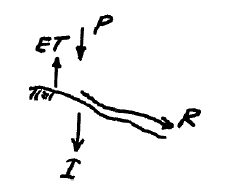

# Lesson 1 Hydrologic Cycle

1. Water Budget Example
2. Hydrologic Cycle
3. Watershed Delineation
   1. By-hand 
   2. Automated
4. Watershed Metrics
   1. Drainage Area
   2. Main Channel Length
   3. Slope(s)


## Water Budget Definition
The water budget, or <strong>hydrologic balance</strong> is simply the expression of the conservation of mass in hydrologic terms for a hydrologic system.  
Generally it is expressed as a rate (or volume) balance.
The hydrologic equation is the fundamental tool in hydrology to describe amounts of water in storage in different compartments at different scales.  

The equation expressed in “words” is

Rate of inflow - Rate of outflow =  Rate of change of storage + Rate of internal mass generation.

Symbolically it is exrepssed as:

$$ \frac{dI}{dt} - \frac{dO}{dt} = \frac{dS}{dt} + \frac{dG}{dt}$$

where

$I$ is inflow volume, $O$ is outflow volume, $S$ is storage volume (i.e. within a watershed), and $G$ is generated volume.
$G$ is generally zero, but is included to be consistent with the balance equations you have learned elsewhere (i.e. environmental engineering, chemistry, $\dots$)

## Water Budget Example
Consider the following problem statement:


One way to answer the questions is to decompose the problem into a simpler construct, usually by sketching a diagram as shown below:



Now we can simply assign the terms to the appropriate parts of the water balance equation and solve for unknown components such as:


For more utility we can use our Computational Thinking (ENGR-1330) skills and write a simple script to generalize the results and help with unit conversions


```python
# Water Budget Script - Example in WebBook
P = 254 # millimeters of rainfall 
ET = 85 # millimeters of evapotranspiration
I = 20 # millimeters of infiltration
DeltaS = 0 # millimeters of storage change

R = P - ET - I + DeltaS

print("Runoff = ",round(R,3),' watershed millimeters')
```

    Runoff =  149  watershed millimeters


Now to convert to other units as requested, we simply apply conversions as:


```python
def mm2m(mm):
    # convert mm into meters
    mm2m = mm/1000.0 # mm should be a float
    return(mm2m)

def sqkm2sqm(sqkm):
    # convert square kilometers into square meters
    sqkm2sqm = sqkm * 1.0e06 # sqkm should be a float
    return(sqkm2sqm)

def cum2liter(cum):
    # convert cubic meters into liters
    cum2liter = cum*1000.0 # cum should be a float
    return(cum2liter)

# now express result in useful units
area = 65 # area in sq. kilometers

WholeWatershedRunoff = mm2m(R)*sqkm2sqm(area)

print("Runoff = ",round(WholeWatershedRunoff,3),' cubic meters')

print("Runoff = ",round(cum2liter(WholeWatershedRunoff),3),' liters')
```

    Runoff =  9685000.0  cubic meters
    Runoff =  9685000000.0  liters


Now estimate largest population this hydrology could support


```python
# Population supported at 160 L/day
litersPerDayPerPerson = 160
litersPer2months = litersPerDayPerPerson*2*30
# Assume all Runoff is Run through kidneys and colons
maxPeople = cum2liter(WholeWatershedRunoff)/litersPer2months
print("Maximum Population = ",maxPeople," if rainfall is firm")
```

    Maximum Population =  1008854.1666666666  if rainfall is firm


---
# Watersheds

Recall our definitions:

- Topographic area that collects and discharges surface streamflow through one outlet or mouth (pour point)
- The area on the surface of the Earth that drains to a specific location
- In groundwater a similar concept is called a groundwater basin – only the boundaries can move depending on relative rates of recharge and discharge 

The topographic definition omits that there could be subsurface sewer systems that can cross topographic boundaries.   
It’s a big deal in urban areas.

[insert some images]

## Watershed Delineation

### By-hand

### Stream Stats Tool

## Watershed Metrics

### Measuring Area
### Measuring Length(s) 
### Estimating Slope(s)


# References

cite pages of textbook

links to other readings 


