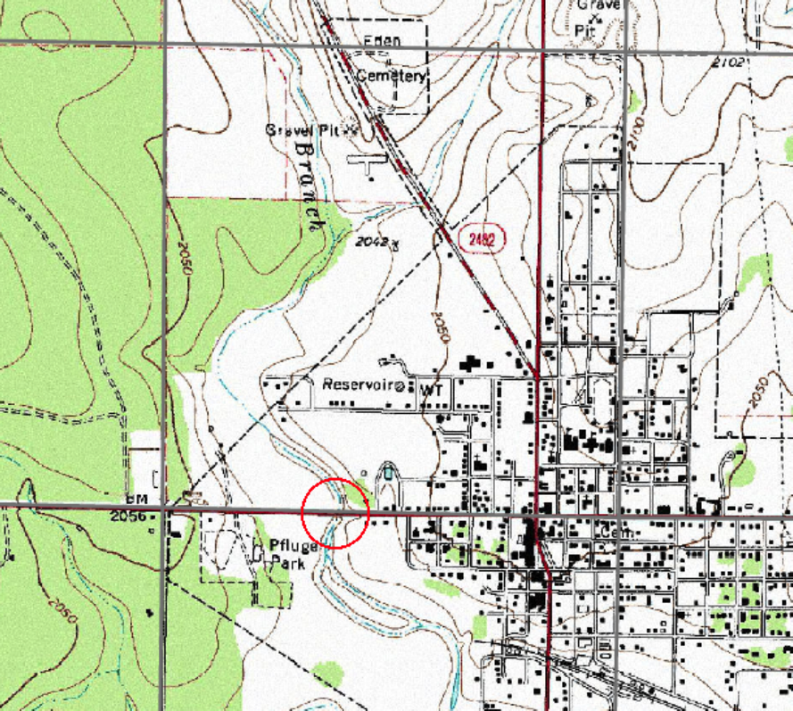

# CE 3354 Exercise Set 18 (Summer 2021)
You can download this document as a JupyterLab notebook [here](https://3.137.111.182/ce-3354-webbook/lesson8/es8.ipynb)

## Semester Project Problem Statement
Figure 1 is a map of a portion of Concho County, Texas.  In the Southeast corner of the map is Eden, Texas.  A US highway runs nearly East-West through Eden and another US highway runs North-South.  This watershed is the subject of the semester design project.



|Figure 1.  Excerpt from Larger Map|
|---|

### Purpose 
The existing culvert system is a 2-barrel 6X6 box-culvert system.  This report presents an hydrologic analysis of the existing system at an appropriate risk level to determine the depth of water at the structure (or overtopping depth), and a determination of the depth of flow if the culvert system is modified by the addition of two more barrels to a total of 4-barrel 6X6 box-culvert system.

## Report Templates:

Report templates are supplied below, the PDF is included becuse it can be rendered on the server through a web browser; use your preferred Word Processor tool.

An AdobeAcrobat document (PDF) is located at: [report-template-week4.pdf](https://3.137.111.182/ce-3354-webbook/lesson18/report-template-week4.pdf)

A MicrosoftWord document (docx) is located at: [report-template-week4.docx](https://3.137.111.182/ce-3354-webbook/lesson18/report-template-week4.docx)

A LibreOffice document (odt) is located at: [report-template-week4.docx](https://3.137.111.182/ce-3354-webbook/lesson18/report-template-week4.docx)

## Exercise: 
Using the report template; populate (add words and figures) the following sections:

 - HEC-HMS Conceptualization:
 1. Hydrograph Routing Elements: Channel Elements
 2. Reservoir Storage Elements: Elevation Area Tables for
   1. North Reservoir
   2. South Reservoir
   3. US-87 Crossing (Reservoir)
 3. Results:
   1. Existing conditions (state the conditions)
   2. Proposed conditions (state the conditions)
   
At this point you should be able to caption many figures and tables, as well as populate tables.

Cite sources used and put citations in the references section.

Save your work as a PDF file to upload to the class server, and keep a copy for continuing work on the project for the remainder of the class.


```python

```


```python

```
