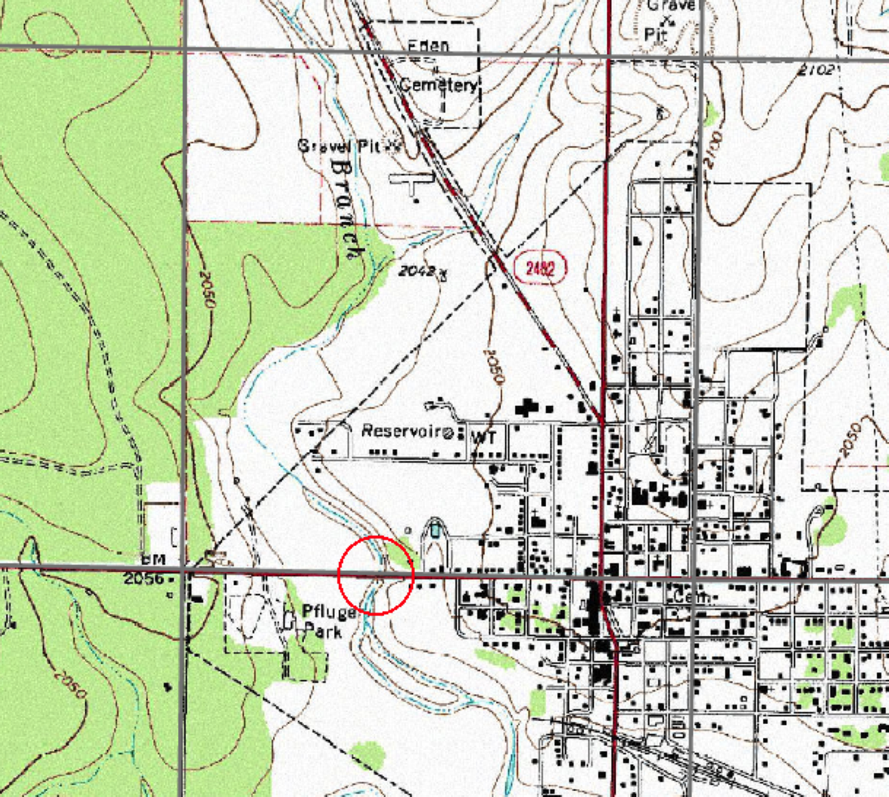

# CE 3354 Exercise Set 3 (Summer 2021)
You can download this document as a JupyterLab notebook [here](https://3.137.111.182/ce-3354-webbook/lesson3/es3.ipynb)

## Semester Project Problem Statement
Figure 1 is a map of a portion of Concho County, Texas.  In the Southeast corner of the map is Eden, Texas.  A US highway runs nearly East-West through Eden and another US highway runs North-South.  This watershed is the subject of the semester design project.



|Figure 1.  Excerpt from Larger Map|
|---|

### Purpose 
The existing culvert system is a 2-barrel 6X6 box-culvert system.  This report presents an hydrologic analysis of the existing system at an appropriate risk level to determine the depth of water at the structure (or overtopping depth), and a determination of the depth of flow if the culvert system is modified by the addition of two more barrels to a total of 4-barrel 6X6 box-culvert system.

## Report Templates:

Report templates are supplied below, the PDF is included becuse it can be rendered on the server through a web browser; use your preferred Word Processor tool.

An AdobeAcrobat document (PDF) is located at: [report-template-week1.pdf](https://3.137.111.182/ce-3354-webbook/lesson3/report-template-week1.pdf)

A MicrosoftWord document (docx) is located at: [report-template-week1.docx](https://3.137.111.182/ce-3354-webbook/lesson3/report-template-week1.docx)

A LibreOffice document (odt) is located at: [report-template-week1.docx](https://3.137.111.182/ce-3354-webbook/lesson3/report-template-week1.docx)

## Exercise 1: 
Using the report template; populate (add words and figures) the following sections:
 - introduction.  Add some narrative.
 - watershed.  In ES-2 you delineatedthe watershed that drains to the bridge.  Put a graphic into the report based on your delineation and complete the table.
 - soil properties.  Use the WSS tool, and determine soil properties for the area (outside of Eden); Put a screen capture into the report based on your delineation .
 
Cite sources used and put citations in the references section.

Save your work as a PDF file to upload to the class server, and keep a copy for continuing work on the project for the remaindeer of the class.


```python

```
