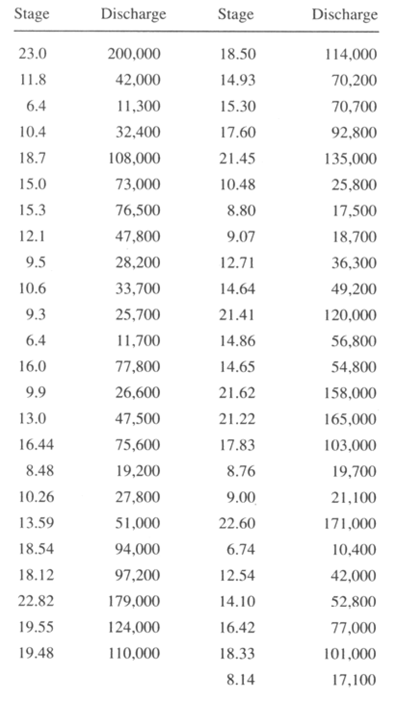

# CE 3354 Exercise Set 5 (Summer 2021)
You can download this document as a JupyterLab notebook [here](https://3.137.111.182/ce-3354-webbook/lesson5/es5.ipynb)

Figure 1 below is the gage height and **annual peak discharge** for some gaging station in Oklahoma. The stage is in feet and the discharge is in cubic feet per second. The data are sequential from 1923 through 1971.



You can download an ASCII file of the data from [https://3.137.111.182/ce-3354-webbook/lesson5/OklahomaData.txt](https://3.137.111.182/ce-3354-webbook/lesson5/OklahomaData.txt)

# Exercise 1:

1. Plot year versus stage ( x-axis is year).
2. Plot year versus discharge ( x-axis is year).
3. Plot the discharge versus stage.

# Exercise 2:

Is there a correlation between stage and discharge? 

# Exercise 3:

<!--Using the Weibull plotting position formula, determine the distribution parameters that fit the data for a log-normal distribution data model.-->
<!--Using the Weibull plotting position formula, determine the distribution parame-
ters that fit the data for a Gumbell distribution data model.-->
Using the Weibull plotting position formula, determine the distribution parameters that fit the data for a Gamma distribution data model.  Produce a plot of the data and fitted model.

# Exercise 4:
Estimate the discharge associated with a 25-percent chance exceedence probability (i.e. the value that is equal to or exceeded with a 1 in 4 chance) using the Gamma distribution data model.

# Exercise 5:
Use USGS PeakFQ to analyze these data (you will have to manually enter the data).

# Exercise 6:
A resident claims that in the early 1900's a flood corresponding to a stage of 30 feet occurred at the gage location. Estimate the exceedence probability (return period) of the flow assicoated with this event.


```python

```
