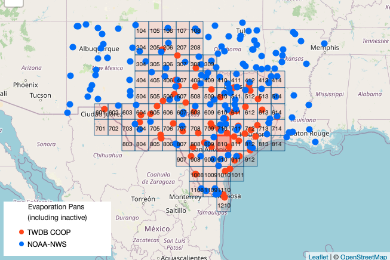

# CE 3354 Exercise Set 7 (Summer 2021)
You can download this document as a JupyterLab notebook [here](https://3.137.111.182/ce-3354-webbook/lesson7/es7.ipynb)

## Exercise 1: 
Estimate the monthly evapotranspiration depths for the San Angelo (Concho County)
area using the Blaney-Criddle method.

## Exercise 2:
Estimate the monthly evapotranspiration depths for the San Angelo (Concho County)
area using the Thornwaithe method.

## Exercise 3: (Data Science)
In Texas, evaporation rates (reported as inches per month) are available from the Texas Water Development Board. [https://waterdatafortexas.org/lake-evaporation-rainfall/](https://waterdatafortexas.org/lake-evaporation-rainfall/)

The map below shows the quadrants (grid cells) for which data are tabulated.

- Which cell most closely covers Concho County (405,406,505,506, or another cell)?  
- A copy of the dataset downloaded from the Texas Water Development Board is located at [https://3.137.111.182/ce-3354-webbook/lesson7/all_quads_gross_evaporation.csv](https://3.137.111.182/ce-3354-webbook/lesson7/all_quads_gross_evaporation.csv).   Using methods from Computational Thinking and Data Science (ENGR 1330); analyze the database and extract the average monthly evaporation depths for San Angelo (Concho County).

## Exercise 4:

Tabulate the results for the three methods (i.e. complete the table below)

|Month|ET-Thornwaithe (inches)|ET-Blaney Criddle (inches)|Evaporation-TWDB (inches)|
|:---|---:|---:|---:|
|Jan| xxx.xx| xxx.xx| xxx.xx|
|Feb| xxx.xx| xxx.xx| xxx.xx|
|Mar| xxx.xx| xxx.xx| xxx.xx|
|Apr| xxx.xx| xxx.xx| xxx.xx|
|May| xxx.xx| xxx.xx| xxx.xx|
|Jun| xxx.xx| xxx.xx| xxx.xx|
|Jul| xxx.xx| xxx.xx| xxx.xx|
|Aug| xxx.xx| xxx.xx| xxx.xx|
|Sep| xxx.xx| xxx.xx| xxx.xx|
|Oct| xxx.xx| xxx.xx| xxx.xx|
|Nov| xxx.xx| xxx.xx| xxx.xx|
|Dec| xxx.xx| xxx.xx| xxx.xx|
