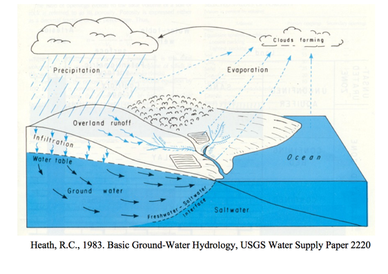
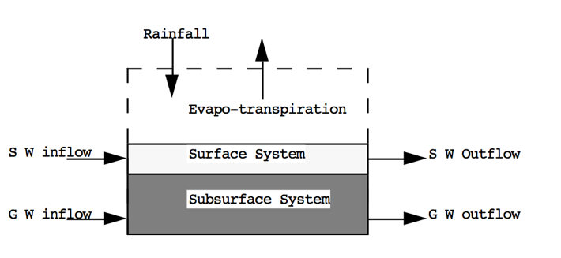
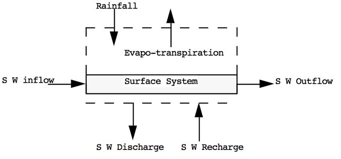

# Lesson 0

- Introduction
- Course Resources
  - Blackboard
  - This WebBook
- Surface and Groundwater Hydrology Concepts

## Introduction

[static link to my About Me page on a webserver]

[link to syllabus, also in navigation bar]

## Course Resources

- Tour of the webbook.
- Tour of Blackboard:
   - Quizzes
   - Homework
   - Exams
   - Report

# Fundamental Concepts

## What is hydrology?
- Study of the occurrence, circulation, storage, and distribution of surface and groundwater on the Earth.
- Engineering hydrology is the quantification of amounts of water at various locations (spatially) as a function of time (temporally) for surface water applications.

## What is a watershed (catchment)?
Here are a couple of definitions of watersheds.

- Topographic area that collects and discharges surface streamflow through one outlet or mouth (pour point)
- The area on the surface of the Earth that drains to a specific location
- In groundwater a similar concept is called a groundwater basin – only the boundaries can move depending on relative rates of recharge and discharge 

The topographic definition omits that there could be subsurface sewer systems that can cross topographic boundaries.   It’s a big deal in urban areas.

## What is a hydrologic system?
A hydrologic system is just a collection of parts that interact.   
 
- A hydrologic system is simply the collection of connected components that form the <strong>hydrologic cycle</strong>
- These components can be grouped into subsystems, treated separately, and the results combined according to interactions between the subsystems (CMM pg 5) 

Like in fluid mechanics, the system has boundaries (the control volume) and fluxes into/out of the boundaries.   
The entire planet is usually considered a closed system (hydrologically) and only the energy fluxes cross the boundary.   
At more practical scales (parking lot) the mass fluxes matter a lot.  

## What is the hydrologic cycle?
Here is a typical diagram depicting the hydrologic cycle.  

The driving force for the cycle (not shown) is solar energy that provides the energy to vaporize liquid water that then rises into clouds, moves onshore, and rains (or snow, sleet, $\dots$.  and other forms of <strong>precipitation</strong>)
A portion of the rain becomes runoff, another portion returns to the atmosphere as evaporation, another portion infiltrates into the ground and becomes groundwater.

The surface water system would be the part of the diagram that lies above the plane defined by the ocean and infiltration line.
The subsurface system is the part that is below this plane.

Expressed as a simple system diagram it would be depicted in the figure below

# Hydrologic Balance 

## What is a water budget?
The water budget, or <strong>hydrologic balance</strong> is simply the expression of the conservation of mass in hydrologic terms for a hydrologic system.  
Generally it is expressed as a rate (or volume) balance.
The hydrologic equation is the fundamental tool in hydrology to describe amounts of water in storage in different compartments at different scales.  

The equation expressed in “words” is

Rate of inflow - Rate of outflow =  Rate of change of storage + Rate of internal mass generation.

Symbolically it is exrepssed as:

$$ \frac{dI}{dt} - \frac{dO}{dt} = \frac{dS}{dt} + \frac{dG}{dt}$$

where

$I$ is inflow volume, $O$ is outflow volume, $S$ is storage volume (i.e. within a watershed), and $G$ is generated volume.
$G$ is generally zero, but is included to be consistent with the balance equations you have learned elsewhere (i.e. environmental engineering, chemistry, $\dots$)

## Surface Hydrologic System

Here is the surface water system broken into its own sub-system.

Notice the dashed line is the boundary – exactly like a control volume in fluids.

### Surface Water Budget

From the surface water system diagram, appropriate budget components are:

- Inflows:  Rainfall; Surface water from outside boundary, recharge from Groundwater.
- Outflows: Evapotranspiration; Surface water leaving boundary; Infiltration to groundwater.
- Storage:  Water levels in lakes, rivers, ponds within the boundary; water stored on leaves and other surfaces.

## Sub-surface Hydrologic System

Here is the sub-surface water system broken into its own sub-system.

Notice the dashed line is the boundary – exactly like a control volume in fluids.

### Sub-surface Water Budget

From the sub-surface water system diagram, appropriate budget components are:

- Inflows:  Groundwater flow from outside boundary; Recharge from surface system (via infiltration)
- Outflows: Groundwater flow out of the boundary; Discharge (pumping; springs) to surface system
- Storage:  Water levels in aquifers within the boundary

## Combined Hydrologic System
Here are the two systems “combined.”
Communication is by the two shaded paths on the figure. 

Loss from the surface system becomes gain to the ground system.
Loss from the ground system becomes gain to the surface system.

# References

cite pages of textbook

links to other readings 